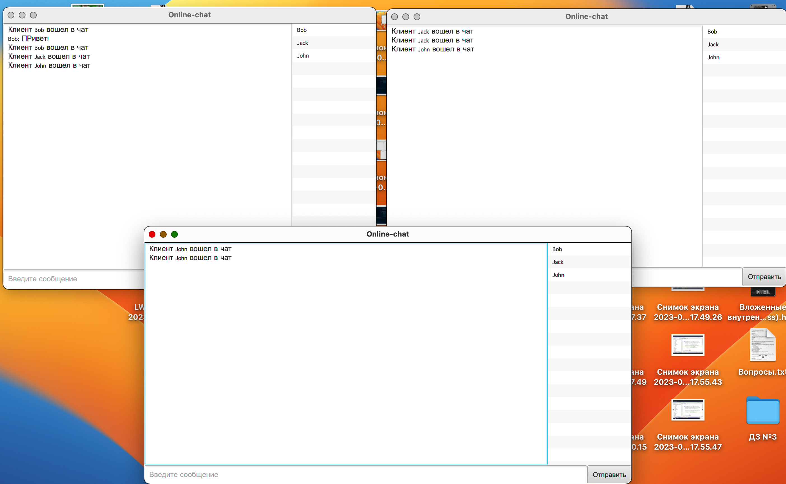

  

<h2> Назначение проекта </h2>

<h3> OnLine Chat - приложение для обмена текстовыми сообщениями между пользователями (OnLine Chat состоит из клиентской и серверной части)</h3>
<body>
   <dev>
   
Сервис позволяет:

     <ul>
     <li>Производить регистрацию пользователей;</li>
     <li>Авторизация пользователей по логину и паролю.;</li>
     <li>Сохранять всю историю переписки между пользователями в отдельном файле;</li>
     <li>Отслеживать состояние пользователей в чате (Online\Offline);</li>
     </ul>
   </dev>
  <dev>
   
Сервис в своей работе использует:

   <ul>
     <li>Многопоточную обработку клиентских подключений;</li>
     <li>Для сохранения данных пользователей (логин\пароль) sqlite database;</li>
     <li>На стороне серверной части: библиотека java.net (ServerSocket);</li>
     <li>На стороне клиентской части: платформу сервисных приложений JavaFx;</li>  
     <li>Для сборки проекта используем Apache Maven;</li>
     </ul>
  </dev>
    <dev>
   
 Окно входа 

    
   
 Основной экран приложения с тремя пользователями 

    
    </dev>   
  
  

  <dev>
     <h2>Сборка приложения:</h2>

   <dev>
   
Требуется выполнить следующие шаги:

     <ul>
     <li>Сделать git clone этого проекта: <a href="https://github.com/AndreyIgnatev/AndreyIgnatev-Chat-Online-Project.git">https://github.com/AndreyIgnatev/AndreyIgnatev-Chat-Online-Project.git</a></li>
     <li>Собрать архив при помощи maven, используя команду в терминале: <code>mvn clean package</code></li>
    </ul>
         </dev>
  </dev>
   

     <dev>
     <h2>Технические требования:</h2>
<ul> 
<li> Java версии не ниже 8; </li> 
</ul>
</dev>